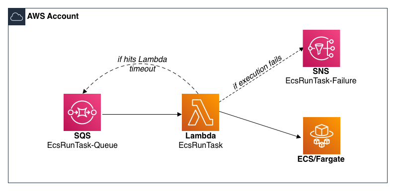

# aws-lambda-amazon-ecs-run-task

### Description:
This function will allow you to run an AWS ECS Task from an SQS Queue. 

### Folder Structure
| Folder/File | Description |  
| :-------------------------| :-------------------------------------------------------------------------------------------------------------------|
| cloudformation/sam-bootstrap.yaml  | AWS Cloudformation template that will create the required AWS Resources for the solution to work properly. It will create an IAM Role, KMS Key/Alias and S3 Bucket. All of these AWS Resources are required for an AWS Serverless Application Model (SAM) deployment to successful.|
| cloudformation/function.yaml | SAM template that will deploy the AWS Lambda Function along with all dependant infrastructure. | 
| src     | Source code for AWS Lambda Functions. |
| test     | Test code for AWS Lambda Functions. |
| scripts   | Directory that has the scripts that will be ran from a CodeBuild BuildSpec file |
| scripts/main.sh | An orchestration script that will run the all other linting/scanning scripts before building/deploying the SAM Function(s). | 
| scripts/pylint.sh   | Shell script that will run the ```pylint``` command against all python files. |
| scripts/pyscan.sh   | Runs Bandit (python lib) against all python code within the repository to identify any security vulnerabilities. |
| scripts/sam.sh   | Runs a number of SAM commands to package / build / deploy the SAM Function to a specified account. | 
| scripts/test.sh   | Shell script that will run the ```tox``` command to build a virtual environment and the ```pytest``` command to run any unit tests found in the repository. |
| pytest.ini   | ini files are the configuration files of the tox project, and can also be used to hold pytest configuration if they have a [pytest] section. |
| test_requirements.txt   | Pip requirements file for test environment. |
| tox.ini | Configured file for Tox. Tox is a command-line driven automated testing tool for Python, based on the use of virtualenv. |

## Pre-requisite Steps:
- Install the Serverless Application Model CLI (SAM) [Link to AWS Doc](https://docs.aws.amazon.com/serverless-application-model/latest/developerguide/serverless-sam-cli-install.html)
  - Since this solution builds the SAM function inside Lambda-like container, Docker must be installed and running on your workstation.

## How to deploy
### AWS Management or Shared Services Production Account
- Run the cloudformation/sam-bootstrap.yaml into the AWS Account you chose.

  ```bash
  aws cloudformation create-stack --stack-name SAM-Bootstrap --template-body file://cloudformation/sam-bootstrap.yaml
  ```

- Deploy Serverless Application Model function.
  ```bash
  bash scripts/sam.sh
  ````
  
## How does the Lambda ECS Run Task work 

### Reference Architecture
 

### Input Parameters / Configuration
message_body ECS

* **cluster** (*string*) --

  The short name or full Amazon Resource Name (ARN) of the cluster on which to run your task. If you do not specify a cluster, the default cluster is assumed.

* **task_def** (*string*) -- 
  
  The family and revision (family:revision ) or full ARN of the task definition to run. If a revision is not specified, the latest ACTIVE revision is used.

* **container_name** (*string*) -- 
  
  The name of the container that receives the override. This parameter is required if any override is specified.

* **environment** (*list*) -- 
  
  The environment variables to send to the container. You can add new environment variables, which are added to the container at launch, or you can override the existing environment variables from the Docker image or the task definition. You must also specify a container name.

  (dict) --
  A key-value pair object.

    * **Name** (*string*) --

  The name of the key-value pair. For environment variables, this is the name of the environment variable.

    * **Value** (*string*) --

  The value of the key-value pair. For environment variables, this is the value of the environment variable.
    
* **command** (*list*) --
  
  The command to send to the container that overrides the default command from the Docker image or the task definition. You must also specify a container name.

* **subnets** (*list*) -- 
  
  The IDs of the subnets associated with the task or service. There is a limit of 16 subnets that can be specified per AwsVpcConfiguration 

* **security_groups** (*list*) --
  
  The IDs of the security groups associated with the task or service. If you do not specify a security group, the default security group for the VPC is used. There is a limit of 5 security groups that can be specified per AwsVpcConfiguration 

* **cpu** (*string*) --
  
  The cpu override for the task.
  
* **memory** (*string*) --

  The memory override for the task.

#### SQS Message Example Code [JSON]:
To easily present the ECS Task data to the Lambda Function the message must into a dictionary using the ECS key. 

```json 
message_body['ECS'] = {
  "cluster": "container-test01", 
  "taskDefinition": "container-test01:6", 
  "service": "container-test01", 
  "launchType": "FARGATE", 
  "platformVersion": "LATEST", 
  "propagateTags": "TASK_DEFINITION", 
  "overrides": {
    "containerOverrides": [
      {
        "name": "container-test01-development", 
        "command": ["sh", "-c", "sleep 120 && df -h"], 
        "environment": [
          {"name": "s3_image_id", "value": "00000.tiff"}, 
          {"name": "s3_bucket", "value": "testapp22-111122223333-us-east-1"}, 
          {"name": "sleep_time", "value": "1"}
        ]
      }
    ], 
    "cpu": "1024", 
    "memory": "2048"
  }, 
  "networkConfiguration": {
    "awsvpcConfiguration": {
      "subnets": ["subnet-1234567890abcdef0", "subnet-abcdef01234567890"], 
      "securityGroups": ["sg-021345abcdef6789"], 
      "assignPublicIp": "ENABLED"
    }
  }, 
  "referenceId": ""}
}
```

#### SQS Message Example Code [JSON]:
Before sending the message to the queue ensure the message body is converted to a string.

```python
...

queue_url = f"https://sqs.us-east-1.amazonaws.com/111122223333/EcsRunTask"
response = sqs.send_message(
    QueueUrl=queue_url,
    MessageBody=json.dumps(message_body)
)

...

```

#### Running Local Send Message Test
- Update test/local_send_message_test.yaml with environment information (i.e. cluster name / service / etc)
- Run local_send_message_test.py script
  ```bash
  python3 test/local_send_message_test.py 
  ```
